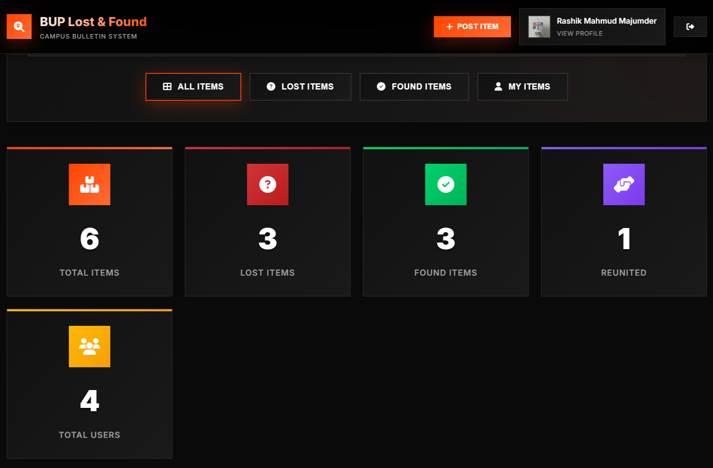
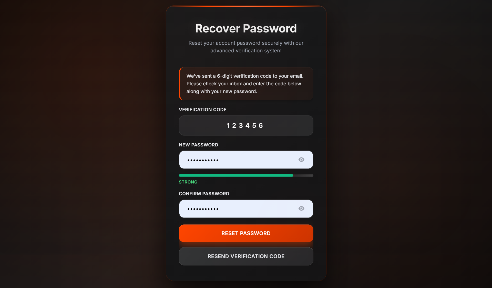

# Campus Lost & Found

A full-stack web application for reporting, browsing, and managing lost and found items on a university campus. This project was developed for the **Software Development Project I (SDP-I)** course.

The system helps students publish lost item reports, submit found item reports, view item details, and keep track of their own submissions through a protected profile dashboard.



## Project Information

| Field | Details |
| --- | --- |
| Project name | Campus Lost & Found |
| Course | Software Development Project I (SDP-I) |
| Developed by | Rashik Mahmud Majumder |
| Repository | `mahmudrashik/Campus-Lost-Found` |

## Key Features

- Student registration with email OTP verification.
- Secure login with bcrypt password hashing and JWT-based authentication.
- Password reset flow using email reset links.
- Protected student profile page with account details and personal reports.
- Lost item reporting with place, time, date, and image upload.
- Found item reporting with place, time, date, and image upload.
- Public lost and found item listings on the homepage.
- Item detail view with poster information and connected item status.
- MongoDB persistence through Mongoose models.
- Responsive pages built with HTML, CSS, JavaScript, and Bootstrap.

## Tech Stack

| Layer | Technologies |
| --- | --- |
| Frontend | HTML, CSS, JavaScript, Bootstrap |
| Backend | Node.js, Express.js |
| Database | MongoDB, Mongoose |
| Authentication | bcrypt, JSON Web Token |
| Email service | Resend |
| File uploads | Multer |

## Screenshots

| Login | Reset Password |
| --- | --- |
|  |  |

## Requirements

Before running the project, make sure the following are installed or available:

- Node.js and npm
- MongoDB running locally or through a hosted MongoDB connection
- A Resend API key for OTP and password reset email delivery

## Installation

Clone the repository:

```bash
git clone https://github.com/mahmudrashik/Campus-Lost-Found.git
cd Campus-Lost-Found
```

Install dependencies:

```bash
npm install
```

Create a `.env` file in the project root:

```env
RESEND_API_KEY=your_resend_api_key
JWT_SECRET=your_jwt_secret
```

Start MongoDB locally:

```bash
mongod
```

Run the server:

```bash
node server.js
```

Open the application:

```text
http://localhost:5000
```

## Main Routes

| Route | Purpose |
| --- | --- |
| `/` | Homepage with lost and found item listings |
| `/login.html` | Student login |
| `/register.html` | Student registration |
| `/otp.html` | OTP verification after registration |
| `/forgot-password.html` | Request password reset link |
| `/reset-password.html` | Set a new password |
| `/profile.html` | Protected student profile and reports |
| `/post-lost.html` | Submit a lost item report |
| `/post-found.html` | Submit a found item report |
| `/connect-lost-found.html?id=<item_id>` | View item details and connected item information |

## API Overview

| Method | Endpoint | Description |
| --- | --- | --- |
| `POST` | `/api/register` | Registers a student and sends an OTP |
| `POST` | `/api/verify-otp` | Verifies OTP and activates the account |
| `POST` | `/api/login` | Authenticates a student and returns a JWT |
| `POST` | `/api/forgot-password` | Sends a password reset email |
| `POST` | `/api/reset-password` | Updates the password using a valid reset token |
| `GET` | `/api/profile` | Returns authenticated profile information |
| `GET` | `/api/user-posts` | Returns reports created by the logged-in user |
| `POST` | `/api/report-lost` | Creates a lost item report |
| `POST` | `/api/report-found` | Creates a found item report |
| `GET` | `/api/all-items` | Returns all lost and found reports |
| `GET` | `/api/item/:id` | Returns item details and connected item data |
| `POST` | `/api/connect-items` | Connects a matching lost item and found item |

## Folder Structure

```text
Campus-Lost-Found/
|-- public/
|   |-- index.html
|   |-- login.html
|   |-- register.html
|   |-- otp.html
|   |-- profile.html
|   |-- post-lost.html
|   |-- post-found.html
|   |-- connect-lost-found.html
|   |-- forgot-password.html
|   |-- reset-password.html
|   |-- script.js
|   |-- login.png
|   `-- register.png
|-- server.js
|-- package.json
|-- package-lock.json
|-- .gitignore
`-- README.md
```

## Notes

- Uploaded files are handled with Multer. Update the upload destination in `server.js` if the project is moved to a different environment.
- The default server port is `5000`.
- The default local MongoDB database name is `auth_demo`.
- Keep `.env` private and do not commit API keys or JWT secrets.

## Future Improvements

- Add admin moderation for reported items.
- Add search and filtering by item type, location, and date.
- Add claim request workflow for found items.
- Move configuration values such as database URL, port, and upload path into environment variables.
- Deploy the project with MongoDB Atlas and a production email sender.

## Author

Developed by **Rashik Mahmud Majumder** for the SDP-I course.

## License

This project is intended for academic and learning purposes. Add a dedicated license file before using it in a production or commercial environment.
